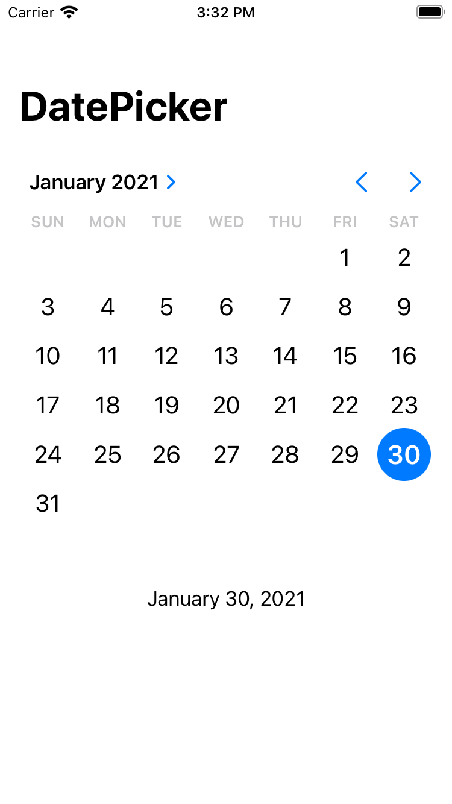

# DatePicker_SwiftUI 
> small idea that enables to select Date. 

If user tap the date on calendar, the bottom text will be chenged immediately. 
 
 
 
# Application Image

  

## Release History

* 0.1.0
    * The first proper release

## Meta

Tomoharu - [https://github.com/Toxumuharu](https://github.com/Toxumuharu)

